# PaperAgent - 学术论文智能分析助手

## 项目愿景

PaperAgent 是一个基于大语言模型的学术论文智能分析平台，旨在帮助研究人员、学生和学者更高效地发现、理解和利用学术资源。通过整合先进的RAG（检索增强生成）技术和可扩展的技能系统，PaperAgent 能够提供从论文检索、深度分析到文献综述的全方位学术研究支持。

### 核心价值主张

- **智能论文理解**：超越简单的文本搜索，提供深度的论文内容理解和结构化分析
- **多模态支持**：支持PDF、Markdown等多种格式的学术论文处理
- **可扩展架构**：基于Claude技能系统的模块化设计，支持功能动态扩展
- **研究效率提升**：从数小时的文献阅读缩短到几分钟的关键信息提取

## 架构总览

PaperAgent 采用前后端分离的微服务架构，具备高度的可扩展性和维护性。

### 系统架构图

```mermaid
graph TD
    A["(根) PaperAgent"] --> B["backend"];
    A --> C["frontend"];
    A --> D[".claude/skills"];

    B --> E["核心服务层"];
    E --> F["agents/paper_agent"];
    E --> G["rag"];
    E --> H["services"];
    E --> I["api"];
    E --> J["core"];
    E --> K["models"];
    E --> L["dao"];
    E --> M["skills"];

    C --> N["UI组件层"];
    N --> O["components"];
    N --> P["hooks"];
    N --> Q["services"];
    N --> R["utils"];

    D --> S["技能模块"];
    S --> T["paper-analysis"];
    S --> U["literature-review"];
    S --> V["citation-management"];
    S --> W["data-extraction"];
    S --> X["rag-enhancement"];
    S --> Y["github-integration"];

    click F "./backend/app/agents/paper_agent/CLAUDE.md" "查看 Paper Agent 模块文档"
    click G "./backend/app/rag/CLAUDE.md" "查看 RAG 模块文档"
    click H "./backend/app/services/CLAUDE.md" "查看 Services 模块文档"
    click I "./backend/app/api/CLAUDE.md" "查看 API 模块文档"
    click J "./backend/app/core/CLAUDE.md" "查看 Core 模块文档"
    click M "./backend/app/dao/CLAUDE.md" "查看 DAO 模块文档"
    click N "./frontend/src/components/CLAUDE.md" "查看 Components 模块文档"
    click Q "./frontend/src/services/CLAUDE.md" "查看 Services 模块文档"
    click T "./.claude/skills/paper-analysis/CLAUDE.md" "查看 Paper Analysis 技能文档"
    click U "./.claude/skills/literature-review/CLAUDE.md" "查看 Literature Review 技能文档"
```



### 技术栈

**后端技术栈**
- **框架**: FastAPI (Python 3.10+)
- **数据库**: PostgreSQL + pgvector (向量存储)
- **搜索引擎**: Elasticsearch (全文检索)
- **对象存储**: MinIO (文件存储)
- **LLM集成**: LiteLLM (支持OpenAI、Qwen、DeepSeek等多提供商)
- **RAG框架**: LangChain + LlamaIndex
- **异步处理**: asyncio
- **API文档**: 自动生成OpenAPI文档

**前端技术栈**
- **框架**: React 19 + TypeScript
- **构建工具**: Vite
- **UI组件**: Radix UI + Tailwind CSS
- **状态管理**: React Hooks
- **Markdown渲染**: react-markdown
- **PDF处理**: react-pdf
- **动画**: Framer Motion

## 模块索引

| 模块路径 | 职责描述 | 技术栈 | 状态 |
|---------|---------|--------|------|
| **backend** | 后端API服务 | FastAPI, PostgreSQL, Elasticsearch | ✅ 活跃 |
| **frontend** | 前端用户界面 | React, TypeScript, Vite | ✅ 活跃 |
| **.claude/skills** | Claude技能系统 | Markdown, Python | ✅ 活跃 |

### 核心模块详解

#### 1. Backend 模块
负责所有后端业务逻辑，包括API服务、数据处理、向量存储等。

**主要子模块**:
- `agents/paper_agent`: 论文智能体核心逻辑
- `rag`: 检索增强生成引擎
- `services`: 业务服务层
- `api`: RESTful API接口
- `core`: 核心配置和工具
- `models`: 数据模型定义
- `dao`: 数据访问层

#### 2. Frontend 模块
提供现代化的用户界面，支持论文上传、知识库管理、对话交互等功能。

**主要特性**:
- 响应式设计，支持桌面和移动端
- 实时对话界面
- 知识库可视化管理
- Markdown和PDF文档渲染
- 键盘快捷键支持

#### 3. Skills 模块
基于Claude技能系统的可扩展功能模块，支持动态加载和激活。

**现有技能**:
- `paper-analysis`: 深度论文分析
- `literature-review`: 文献综述生成
- `citation-management`: 引文格式管理
- `data-extraction`: 数据提取
- `rag-enhancement`: RAG增强
- `github-integration`: GitHub集成

## 运行与开发

### 环境要求

**后端**
- Python 3.10+
- PostgreSQL 14+
- Elasticsearch 8.x
- MinIO (可选，用于文件存储)

**前端**
- Node.js 18+
- npm 或 pnpm

### 快速启动

1. **克隆项目**
   ```bash
   git clone <repository-url>
   cd PaperAgent
   ```

2. **后端设置**
   ```bash
   cd backend
   pip install -r requirements.txt
   cp .env.example .env
   # 编辑 .env 文件，配置数据库和API密钥
   alembic upgrade head
   python -m uvicorn app.main:app --reload
   ```

3. **前端设置**
   ```bash
   cd frontend
   npm install
   npm run dev
   ```

### 配置说明

主要配置项在 `backend/app/core/config.py`:
- 数据库连接: `DATABASE_URL`
- Elasticsearch: `ELASTICSEARCH_URL`
- LLM提供商: `OPENAI_API_KEY`, `QWEN_API_KEY`, `DEEPSEEK_API_KEY`
- 对象存储: `MINIO_*` 配置

## 测试策略

### 后端测试
- 单元测试: pytest + unittest.mock
- API测试: httpx + pytest
- 集成测试: 测试完整的RAG流程

### 前端测试
- 组件测试: React Testing Library
- E2E测试: Playwright (计划中)
- 快照测试: Jest

### 测试覆盖率
- 目标: 后端 > 80%，前端 > 70%
- 报告: pytest-cov, jest --coverage

## 编码规范

### Python规范
- 遵循 PEP 8
- 使用 Black 格式化代码
- 类型注解: mypy 检查
- 文档字符串: Google 风格

### TypeScript/React规范
- 使用 ESLint + Prettier
- 组件使用函数式组件和 Hooks
- 严格的 TypeScript 配置
- 组件命名: PascalCase
- 文件命名: PascalCase

### Git规范
- 提交信息: Conventional Commits
- 分支策略: Git Flow
- 代码审查: Pull Request
- Commitlint: 确保提交信息规范

## AI 使用指引

### 技能开发指南
1. 在 `.claude/skills/` 目录下创建新技能
2. 按照 SKILL.md 模板编写技能文档
3. 定义触发词和技能描述
4. 编写技能逻辑（可选）
5. 测试技能集成

### Agent提示词优化
- 使用 base_instruction 作为基础
- 通过 skills_manager 动态注入技能
- 保持提示词简洁明了
- 避免提示词污染

### RAG系统优化
- 使用混合检索策略
- 优化分块策略（chunkers）
- 配置合适的重排序模型
- 监控检索质量指标

## 变更记录 (Changelog)

### 2026-01-17 v1.0.0
- ✅ 初始化项目AI上下文
- ✅ 生成根级CLAUDE.md文档
- ✅ 生成模块级CLAUDE.md文档
- ✅ 创建Mermaid架构图
- ✅ 为所有模块添加导航面包屑
- ✅ 建立技能系统文档框架

### 功能特性
- 🎯 论文智能分析
- 📚 知识库管理
- 💬 对话式交互
- 🔍 智能检索
- 🛠️ 可扩展技能系统
- 📊 多种LLM提供商支持

### 技术架构
- 🏗️ 前后端分离架构
- 🚀 FastAPI + React
- � PostgreSQL + Elasticsearch
- 🧠 LiteLLM多模型支持
- 🎯 LangChain + LlamaIndex RAG
- 🔄 异步处理架构

## 下一步建议

1. **深度补捞扫描**
   - 建议优先扫描以下目录：
     - `backend/app/rag/strategies/` - RAG策略实现
     - `backend/app/rag/chunkers/` - 文档分块策略
     - `frontend/src/components/workspace/` - 工作区组件
     - `.claude/skills/` - 技能实现细节

2. **功能扩展点**
   - 添加更多学术数据库集成（arXiv, PubMed, IEEE Xplore）
   - 实现多语言论文支持
   - 添加图表和公式解析功能
   - 开发协作研究功能
   - 集成版本控制系统（Git）

3. **性能优化**
   - 实现向量数据库索引优化
   - 添加缓存层（Redis）
   - 优化大文件处理流程
   - 实现异步任务队列

4. **用户体验**
   - 添加拖拽上传功能
   - 实现实时协作编辑
   - 开发移动端应用
   - 添加主题切换功能

---

*本文档由 Claude AI 助手自动生成，最后更新时间：2026-01-17 16:02:32*