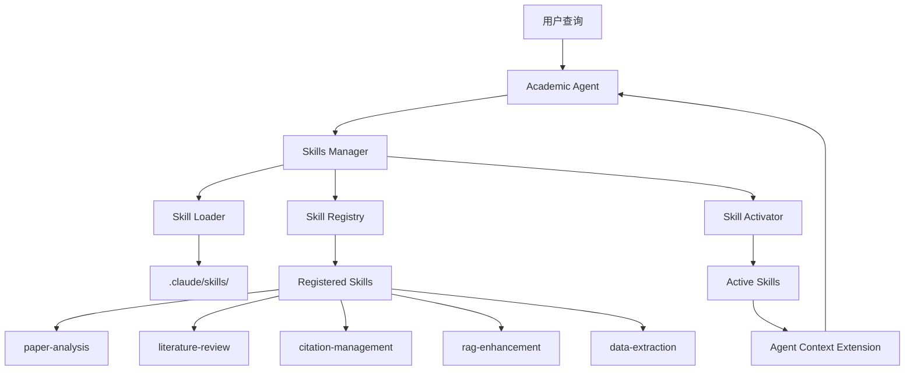

# PaperAgent RAG 系统架构文档

## 1. 系统概述 (Overview)

PaperAgent RAG (检索增强生成) 模块是一个模块化、可扩展的知识库问答系统。它旨在处理多格式的学术文献（PDF, Word, Markdown 等），并通过结合 **LlamaIndex** 的数据处理能力与 **LangGraph** 的工作流编排能力，提供精准的问答服务。

系统的核心设计理念是 **“专业分工”**：
- **LlamaIndex** 负责“脏活累活”：文档解析、切分、向量化和索引管理。
- **LangGraph** 负责“大脑决策”：编排检索、生成、结果校验等逻辑流程。
- **Elasticsearch** 负责“记忆存储”：提供高性能的向量检索与全文检索能力。
- **LiteLLM** 负责“多模型统一”：屏蔽底层模型差异，统一接入 OpenAI, GLM, Qwen, DeepSeek 等模型。

## 2. 技术架构 (Technical Architecture)

```mermaid
graph TD
    User[用户] --> API[FastAPI Router]
    
    subgraph "Ingestion Pipeline (LlamaIndex)"
        API -- 上传文件 --> Upload[文件上传]
        Upload --> Parse[文档解析 (PDF/Docx/MD)]
        Parse --> Chunk[文本切分 (SentenceSplitter)]
        Chunk --> Embed[向量化 (LiteLLM/OpenAI)]
        Embed --> ES[(Elasticsearch Vector Store)]
    end
    
    subgraph "RAG Engine (LangGraph)"
        API -- 提问 --> LG_Start((Start))
        LG_Start --> Node_Retrieve[Retrieve Node]
        Node_Retrieve -- 查询 --> ES
        ES -- 返回 Context --> Node_Retrieve
        Node_Retrieve --> Node_Check{Relevance Check}
        Node_Check -- 通过 --> Node_Generate[Generate Node]
        Node_Generate -- 调用 LLM --> LiteLLM[LiteLLM Proxy]
        LiteLLM --> Node_Generate
        Node_Generate --> LG_End((End))
    end
```

## 3. 核心模块详解

### 3.1 数据摄入层 (Ingestion Layer)
- **文件路径**: `backend/app/rag/ingestion.py`
- **功能**: 处理非结构化文档并建立索引。
- **关键组件**:
    - **SimpleDirectoryReader**: 自动识别并加载 `.pdf`, `.docx`, `.md`, `.txt` 等文件。
    - **SentenceSplitter**: 智能文本切分，保留上下文重叠 (Chunk Size: 1024, Overlap: 100)。
    - **ElasticsearchStore**: 将向量和元数据持久化存储到 Elasticsearch (`index_name: paper_index`)。
- **流程**: 上传 -> 解析 -> 切分 -> Embedding -> 存入 ES。

### 3.2 编排引擎层 (Engine Layer)
- **文件路径**: `backend/app/rag/engine.py`
- **功能**: 定义 RAG 的执行逻辑。
- **基于 LangGraph 的状态机**:
    - **State**: 包含 `question` (问题), `context` (上下文), `answer` (答案), `source` (来源)。
    - **Nodes**:
        - `retrieve_local`: 调用 LlamaIndex 引擎从 ES 检索 Top-5 相关片段。
        - `generate`: 组装 Prompt，调用 LLM 生成最终回答。
    - **Edges**: 定义节点流转逻辑，目前支持 `retrieve -> generate` 的标准流程，预留了 `relevance_checker` 用于未来扩展（如检索质量差时自动联网搜索）。

### 3.3 模型服务层 (Model Configuration)
- **文件路径**: `backend/app/core/config.py` & `backend/app/rag/engine.py`
- **功能**: 统一管理多模型接入。
- **实现**: 使用 `LiteLLM` 和 `LangChain` 的 `ChatLiteLLM` 适配器。
- **支持模型**:
    - **GLM-4** (智谱 AI)
    - **Qwen** (通义千问)
    - **DeepSeek** (深度求索)
    - **OpenAI** (GPT-4o 等)
- **配置方式**: 通过环境变量动态切换，无需修改代码。

### 3.4 API 接口层 (Router)
- **文件路径**: `backend/app/rag/router.py`
- **Base URL**: `/rag`

| 方法 | 路径 | 描述 | 参数 |
| :--- | :--- | :--- | :--- |
| POST | `/rag/upload` | 上传文件并后台索引 | `file`: Binary File |
| POST | `/rag/query` | 提问并获取 RAG 回答 | `{"question": "..."}` |

## 4. 配置指南 (Configuration)

所有配置均集中在 `backend/app/core/config.py`，可通过 `.env` 文件进行管理。

### 环境变量示例 (.env)

```ini
# --- 基础设施 ---
DATABASE_URL=postgresql://user:password@db:5432/paperagent
ELASTICSEARCH_URL=http://es:9200

# --- 模型选择 ---
# 指定默认使用的 LLM 模型 (需与下方 Key 对应)
DEFAULT_LLM_MODEL="glm-4" 
# DEFAULT_LLM_MODEL="qwen-plus"
# DEFAULT_LLM_MODEL="deepseek-chat"

# --- API Keys (按需填写) ---
GLM_API_KEY=your_glm_key
QWEN_API_KEY=your_qwen_key
DEEPSEEK_API_KEY=your_deepseek_key
OPENAI_API_KEY=your_openai_key

# --- Embedding 模型 ---
EMBEDDING_MODEL="text-embedding-3-small"
```

## 5. Agent Skills 系统集成 (✓ 已完成)

PaperAgent 现已集成 Agent Skills 技术，提供模块化的专业能力。

### 5.1 技能系统架构



### 5.2 可用技能

| 技能 | 描述 | 主要功能 |
|------|------|----------|
| **paper-analysis** | 论文深度分析 | 结构识别、方法论提取、创新点识别 |
| **literature-review** | 文献综述生成 | 主题聚类、时间线分析、研究空白识别 |
| **citation-management** | 引用格式化 | APA/IEEE/Chicago格式、引用验证 |
| **rag-enhancement** | RAG系统优化 | 查询优化、混合检索、重排序 |
| **data-extraction** | 数据提取 | 表格解析、性能指标提取、对比矩阵 |

### 5.3 技能工作流程

1. **自动激活**：根据用户查询自动匹配相关技能
2. **指令扩展**：技能的详细指令动态添加到 Agent context
3. **专业响应**：Agent 基于技能指导提供专家级回答
4. **智能管理**：自动管理技能激活/停用，限制最多3个并发

### 5.4 API 端点

- `GET /api/skills`: 列出所有技能
- `POST /api/skills/{name}/activate`: 激活指定技能
- `GET /api/skills/active`: 获取激活的技能
- `POST /api/skills/suggest`: 为查询推荐技能

### 5.5 使用示例

```python
# 用户查询
"帮我分析这篇关于BERT的论文"

# 系统行为
1. 识别关键词："分析"、"论文"
2. 自动激活 paper-analysis 技能
3. 加载技能的完整指令到 Agent 上下文
4. Agent 按照技能指导进行深度分析
5. 返回结构化的分析报告
```

## 6. 扩展路线图 (Future Roadmap)

1.  ✅ **Agent Skills 集成**: 已完成，提供5个核心学术技能
2.  **自适应检索 (Adaptive RAG)**: 完善 `relevance_checker`，当本地文档相关性得分低时，自动回退到 Web Search (Tavily)。
3.  **多模态支持**: 利用 LlamaIndex 的多模态能力解析论文中的图表。
4.  **引用溯源**: 在生成结果中精确标记引用来源的页码和段落。
5.  **技能生态**: 社区贡献更多专业技能（统计分析、实验设计、写作辅助等）


